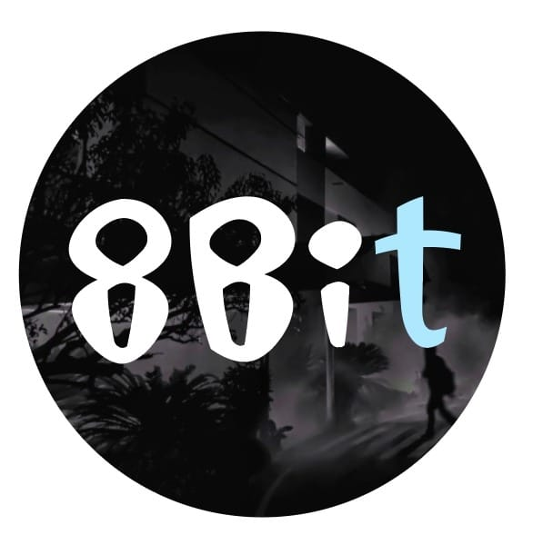
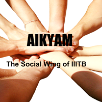
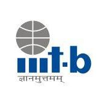
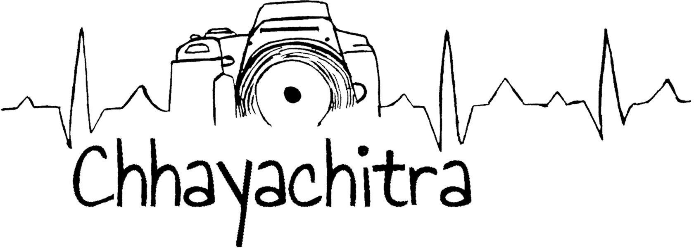
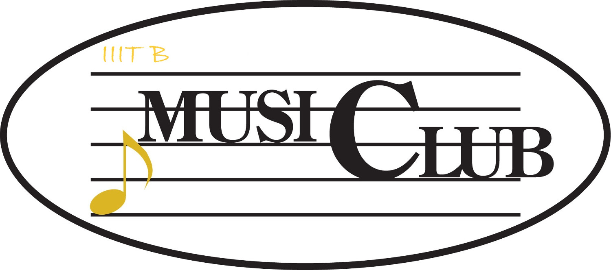

&nbsp;

## 8Bit

 </img>

8Bit is the official magazine of IIIT Bangalore. It is an entirely student-run committee, where they are the sole in-charge of editing the magazine, and deciding its content and structure.

The magazine provides an outlet for your creativity - all your thoughts, artistic endeavors and humor. The best part about 8Bit is that it is not limited to a specific type of content and has a place for everyone - whether you are a designer, artist, writer, editor, poet or just a social person who wants to know people by talking or interviewing them.

Here at 8Bit, the bonds are formed over lively discussion sessions and late night editing and designing marathons.
So join us for a different take in an IT college, to give you a break and let you explore your lesser known interests!

You can check out all our editions <a href="https://iiitbac-my.sharepoint.com/:f:/g/personal/alumnioffice_iiitb_ac_in/EqrUjY3l7oxOkyaGHw4tWvABKIGV4j88cw2jAO514V9blg?e=kS9lTf" target="_blank"> here </a> !!.

## Aikyam

 </img>

Aikyam is the social wing of IIIT Bangalore that was started in 2008 by the students of IIIT Bangalore. It is an initiative taken to help the poor and the needy and understand our <strong>social responsibility</strong>.

What we do as part of Aikyam is plan ‘Aikyam Trips’ to visit orphanages occasionally and spend our day with the children there. We usually collect funds from the students in college before any trip. We buy the necessary items for the children there and also give the funds collected to the orphanage. We generally visit the ‘<a href="http://www.desiresociety.org/" target="_blank">Desire Society</a>’ - a home for HIV affected kids (aged between 3-15) , and ‘Swanthana’ - which is a home for mentally and physically challenged girls. Apart from this, we frequently collect articles like clothes, food and books from the students and donate them to the needy. For example, <a href="https://www.facebook.com/permalink.php?story_fbid=1165116266895953&id=130926363648287" target="_blank">last year on Eid</a>, we collected these articles and donated them to the <a href="http://goonj.org/page_id=22873/" target="_blank">Goonj society</a>.

We also conduct activities in college to spread social awareness among the students. For example, we started two initiatives in 2016 - <a href="https://www.youtube.com/watch?v=ocJbYOnic60&feature=youtu.be" target="_blank">The Little Things and <a href="https://www.facebook.com/pg/Aikyam-130926363648287/photos/?tab=album&album_id=1170969112977335" target="_blank">The Tiny Tales</a>. The Little Things is an initiative where the students make a short video to convey their concern to protect the environment or to support a social cause. The Tiny Tales is another such event where the students write a line or two on what they think they can do for the society. We organise events to raise funds for donation. One such event was putting up a lemonade stall or pani puri stall during the college fest. We also help in organising blood donation camps at our college.

Last year, we celebrated Diwali as a family with all members of our staff. We invited them along with their loved ones to join us and organized games and fun-filled activities for them. We provided them with clothes and money given by the students, along with sweets and crackers so that they could mingle with us on the occasion.

Why do we do all this? We believe that ‘Unity is the secret of social progress, and service to society is the means to promote it’. We spread happiness and awareness. This is the place where we can do our bit for the society and be thankful for all that we have.  

We look forward to join more hands to make our society a happier place to live in. To send in your opinions on what you can do or share any idea on social responsibility or for more such social activities, do mail us at <a href="mailto:aikyam@iiitb.org" target="_blank">aikyam@iiitb.org</a>.

Find us on <a href="https://www.facebook.com/Aikyam-130926363648287/" target="_blank">Facebook</a>.

## Aksh (Literature Club)

‘Aksh’ – The IIITB Literature Club was formed in October 2019 and since then it has been active in organising various events in the campus as well as online during the lockdown. This club is an attempt to foster literary activities such as poetry, writing and reading among the students and allow them to put emotions into words. Literature helps us understand the world in a better way and it brings diverse groups of people together on the same page. It also acts as the means to create a common platform for self-expression, discussions, and mutual learning. The Club aims at not only refining the literary skills of the students but also developing in them logic and curiosity to know more. Club also works on discovering unique ways to develop an understanding, respect and appreciation of others ideas and thoughts.

Type of Events organized by Aksh are: 
1. Poetry recitation
2. Story telling
3. Writing(article/creative/blog/social media post etc)
4. Workshops and Competitions
5. Open Mic Performance
6. Discussions

## Alumni Committee

Being a part of Alumni committee helps us to have a close relationship with the Alumni network of IIIT Bangalore. This enables us to learn and grow as individuals with the help of our alumni's testimonials and suggestions. The various Alumni meets and fests which we organize help them connect with their batchmates and relive those college days which they were a part of.

Being a part of this committee will enable you to make contacts, improve your managerial skills and not to forget ,give you the aura of being connected to seniors who are making it big in the corporate world.

## Branding Committee

 </img>

You are doing a great work, but still not getting recognition from others? Then, you have to think of brand building. Building a brand has become an important aspect for each and everyone these days.

We, the Branding committee at IIIT Bangalore are happy to give students an opportunity to learn how to build a brand. We do promote our institute's good work to the world and keep working on the betterment of our brand image.  We also publicise Institute events such as Spandan, RISE, Sangam, and so on. The team contributes to the institute's social media pages at the time of events and admissions. Also, we design some of our event invitations, posters and T-shirts.

If you are interested in Branding, Digital Media Marketing and Design you can be a part of Branding committee and get hands-on experience in these areas during your stay at IIIT Bangalore.

You can visit us at <a href="https://twitter.com/IIITB_official" target="_blank">Twitter </a>, <a href="https://www.facebook.com/IIITBofficial/" target="_blank">Facebook </a> & <a href="https://www.linkedin.com/school/800493/" target="_blank">Linkedin</a>.

## Chhayachitra

 </img>

The Chhayachitra (Photography Club) at IIIT Bangalore aims to capture each and every beautiful moment of the college's fests and celebrations. Nothing escapes our cameras! Every smile, every moment - whether it's of joy, or just relief from all the exhausting work and every group photo is caught by us. What better feeling can a photographer get other than the perfect click! While creating short films can be tiresome, we have loads of fun ! :)

We help each other in terms of techniques, skills and perspectives for better shots thus making the best out of ourselves as photographers. Although the club was founded in 2015, it is growing fast and gaining popularity.
<!--
The club doesn't just revolve around photographs but also manages its own <a href="https://www.youtube.com/user/iiitbmedia" target="_blank">Youtube</a> & <a href="https://www.instagram.com/iiitb_official/" target="_blank">Instagram</a> channel.
-->

<em><strong>REMEMBER: All it takes is a camera to start with, be it a smartphone or DSLR.</strong></em>

<!-- ## Cite

 </img>

<a href="https://citeatiiitb.wordpress.com/read/recents/" target="_blank">Cite. (Previously ISoClub) - Curating Ideas, Technology & Entertainment.</a>

The club took its present form this April with an aim to make the campus, a stage for active participation and a hotbed of innovative ideas, as well as a platform for discussing the existing ones, old and up and coming through meetings, discussions, presentations and debates on a regular basis. And do not discount on the fun part, our little chats on Sci-Fi movies, music trends, anime etc. will surely act as a stressbuster. Make way for all kinds of discussions, even the crude ones. It will make way for sophisticated ones…

**REMEMBER: It never starts with a sophisticated one!!!**

Find us on <a href="https://www.facebook.com/citeiiitb/" target="_blank">Facebook</a> & <a href="https://www.instagram.com/cite_iiitb/?hl=en" target="_bank">Instagram</a>.

-->

## Comic Club

 </img>

People of the world unite! Gather around and share creativity! The Comic Club is a bunch of geeks who love TV shows, movies, anime or any other creative medium for that matter. Our love exists beyond that of simply consuming the media and since our inception, we have made some fantastic comic strips which have been published in 8bit - our college magazine. We also organise Graffiti walls every now and then so that students can showcase their artistic talent on an open platform. We have also been conducting League of Fanatics in our college fest, infin8, which is considered as one of the most anticipated events at IIIT Bangalore. Not to forget those nights when we sat down for hours discussing anime, mangas, movies etc.

So, if you also share the same interests then...
Hop in, Let's have a great time together!

Find us on <a href="https://www.facebook.com/millionlaugh/" target="_blank">Facebook</a>.

## CAMP

 </img>

<strong> IIITB Club for Algorithms Math & Programming </strong>

This club is all about competitive programming! The sharpest of minds work here. Competitive programming involves application of algorithms and data-structures to solve complex problems within the specified time and memory constraints .The club was formed in 2016 and is lead by ACM-ICPC world finalists. The club's activities involve group discussions, problem solving and competitions.  

Our motto: To produce ACM-ICPC world finalists every year!

Find us on <a href = "https://www.facebook.com/iiitbcp/" target="_blank"> Facebook .</a>

## Dance Club
 </img>

Every time you feel the pressure of assignments and work, the Dance Club comes to the rescue! We provide you with every opportunity to relax, let you hair down, and show us some moves ;)  

Although the club was formed in 2016, we have had tremendous participation and the club has grown by leaps and bounds. The club has organized many events, ranging from groovy DJ nights to serious inter-batch dance competitions. We never miss a chance to perform! We dance at all major college events be it the college's Foundation Day, or Independence Day. We even conducted a flash mob during our college fest - Infin8.

We welcome dancers of all genres, be it Classical , Bollywood or hip-hop to come and join us. However, the dance club is not just for "seasoned" dancers, it's for anyone who has a love and passion for dance, and a willingness to learn. We have had professionals take dance lessons at college, including Zumba sessions and a Bollywood dance workshop during Infin8. And there are always dance jams, where anyone can come and have some fun!!

So shake a leg guys... we're waiting for you!

Join us on <a href = "https://www.instagram.com/iiitbdanceclub/" target = "_blank"> Instagram </a> and <a href = "https://www.facebook.com/groups/840337612790191/" target = "_blank"> Facebook </a>.

## Enigma (Robotics Club)

 </img>

Enigma, the robotics club was founded in 2016. The objective of this club is to develop awareness and interest in robotics and AI. The club is mentored by the seniors and faculty of the college. Here we hold various workshops and help students to start from basics projects like Maze solver, Line Follower and various other small projects. The club works on a few long term projects including a solar powered tiller and a fire fighting drone. These projects are currently funded and mentored by the college.

Follow our <a href="https://www.facebook.com/EnigmaIIITB/" target="_blank">Facebook</a> page.

## Food Committee

Food committee at IIIT Bangalore is a student body which acts as a bridge between the caterer and the students. The committee works on very sensitive and crucial issues like maintaining the sanitary conditions of kitchen, mess, and canteen. They negotiate with the caterer, prepare a menu and try to fit a balance between the taste and quality of the food served in mess. Since IIIT Bangalore has students from all across the country sometimes it becomes difficult to serve everyone as per their needs and wishes for that they have an excellent complaint portal, they not only respond but also solve the problem within 48 hrs in most cases.

This committee gives an exposure to different food cultures in our country and also builds confidence to deal with people of different backgrounds, some are literate some are not, few are so adamant about their point that you need real negotiation skills to get your point established.

If you are someone who needs to polish their managerial skills, friend, this is the right place to start with.
Join us and make a wonderful eating experience for everyone at IIIT Bangalore.

## Google Developer Student Club

 </img>

Google Developer Student Clubs are university-based community groups for students interested in Google developer technologies. Students from all undergraduate or graduate programs with an interest in growing as a developer are welcome. By joining a DSC, students grow their knowledge in a peer-to-peer learning environment and build solutions for their community.

The objectives for Google DSC IIIT-B will be as follows:
1. Creating awareness and preparing candidates for the various opportunities available for them.
2. Providing a platform for inviting speakers and conducting regular sessions/workshops on technical domains.
3. Mentoring peers through their projects, competition preparation, etc.

Find us on <a href = "https://www.instagram.com/dsc.iiitb/" target = "_blank"> Instagram </a> and <a href = "https://www.linkedin.com/company/dsc-iiitb" target = "_blank"> Linkedin</a>.

## Innovation Studio

 </img>

Innovation Studio is a student body, which was formalized in Feb, 2017, with the guidance of <a href="http://www.iiitb.org/" target="_blank">IIIT Bangalore Innovation Center</a> and IIIT Bangalore Faculty.
We started with an aim to foster creative thinking to deliver products that the society needs. We want to develop an ecosystem which provides students with a necessary platform to realize their ideas by utilizing the guidance provided by our faculty, alumni and the strong network of IIIT Bangalore.
Our motto is to promote informal learning and unleash the latent technical and entrepreneurial spirit of IIIT Bangalore.

Find us on <a href="https://www.facebook.com/Innovation-Studio-IIIT-B-1281436805245370/" target="_blank">Facebook</a>.

## Movie Club

IIIT Bangalore's Movie Club consists of huge community of movie lovers in the campus who discuss the latest cine world buzz in an active Facebook group. Movies connect us. The sole purpose of the club is to develop acute movie watching skills to nurture depth in film viewing and appreciation. The collective movie watching experience with best friends is fun at another level needless to say. Being movie enthusiasts, we know that feeling, hence, we organise bi-monthly movie screenings of popular movies for everyone in the campus to make memorable moments which will be cherished lifelong.

Find us on <a href = "https://www.facebook.com/groups/1786495348263059/" target = "_blank"> Facebook </a>.

## Music Club

 </img>

Music club, as the name suggests, is pretty straightforward in its aims and objectives. If you are a singer, an instrumentalist or just a music enthusiast, you are welcome to join us.

Music club has been around for as long as the college has. We have had amazing people, with incredible passion and talent, enthrall us with their awesomeness.

We organise musical nights, where everyone who's part of the club (and others if time permits) get to perform. People in the club also get opportunities to be part of IIIT Bangalore Foundation day, infin8, Spandan and convocation.
Being a part of the club is a wonderful opportunity to meet people equally passionate as you, people with varied tastes in music and people who might give you a new perspective in the way you look at music. Those late night jamming sessions and musical nights will be totally worth the time you invest.

Find us on <a href="https://www.facebook.com/iiitbmusicon/">Facebook</a>.

## Placement Committee

Placement Committe (Final year students) in IIIT Bangalore is an interface between students and the numerous companies that visit our campus. We help students prepare for placements as well as organise company drives on campus. Being a part of Placement Committee gives us an opportunity to interact with each and every member of our batch, and after the placements of each and everyone, the feeling of joy and satisfaction we get is just out of the world. We work closely with the administration and faculty members of the Placement Cell which in itself gives us an immense amount of exposure compared to others.

## SPICMACAY IIIT Bangalore Chapter

 </img>

<a href="http://spicmacay.com/" target="_blank">SPIC MACAY</a> (Society for the Promotion of Indian Classical Music and Culture Amongst Youth) is a non-political, nationwide, voluntary movement founded in 1977 by Dr Kiran Seth, Professor-Emeritus at IIT-Delhi who was awarded the ‘Padma Shri’ for his contribution to the arts in 2009. It organises programmes of classical music and dance, folk arts, crafts, yoga, classic cinema screenings, heritage walks, etc. inside school and college campuses throughout the world to make students more aware about Indian and world heritage. This initiative makes education more holistic and meaningful as it highlights all that is abstract, subtle, inspiring and mystical in the world teaching one to look within oneself.

Among the events that SPIC MACAY IIIT Bangalore chapter organised in the previous years were the Piano concert by Balázs Fülei (pianist from Hungary), Bihu dance by Shri Ranjit Gogoi and team, Chitravina concert by Sri N Ravikiran and Sitar concert by Shri Gaurav Mazumdar. We also had the rare privilege to host Dr. Kiran Seth during a session on Naad Yoga on the campus.

The events organised last year include a violin performance by the maestro TN Krishnan, Bharatanatyam performance by P Praveen Kumar and Yamini.

Yamini was a night filled with pleasant melodies and captivating dances. For twelve hours, from October 31st 6PM to November 1st 6 AM, we were enthralled by the performnaces of leading artistes - by the lilting movements of Methil Devika's Mohiniattam, Carnatic and Hindustani vocals by Bombay Jayashri and Shruti Sadolikar, and the soothing notes of Nityanand Haldipur's Hindustani Bansuri and Seshampatti Sivalingam's Nadaswaram.

SPIC MACAY runs on the energy of volunteers who come from all walks of life - students, teachers, housewives, professional and retired people, young and old. Nishkam Seva is a key aspect of the movement.

<a href="http://spicmacay.com/get-involved" target="_blank">Join us</a>

## Parvaaz

 </img>

One of the most successful groups, Parvaaz has won many accolades for the college in various inter-college festivals with their enthralling performances. Parvaaz is a humble effort to bring artistic expression to the campus in the form of a plethora of thespian talents such as stage play, mime, theatre, street play, short films, parodies. We, the members of Parvaaz have delighted the audience by their performances on Teacher's day, Women's day, as well as raised and created awareness on issues like food wastage(along with Food committee), and sexual harassment(along with Internal Complaints Committee), essentially capturing the zeitgeist of quintessential campus life. We also work in collaboration with Chhayachitra in producing promotional videos like Sangam, Yamini promotion, Campus life video etc. and also with the music club and placement committee for the parody of Kabir Singh, namely Fakir Singh which was loved by the audience for its songs and comedy. 

We also participate in interactive college theatre competitions.
If you find yourself bitten by the theatre bug, and want to showcase your talents in acting, writing, direction and screenplay, costume design or video editing, avail yourself a position amongst us. You are guaranteed to learn, teach, and most importantly have fun.

Find us on <a href="https://www.facebook.com/groups/240678619795576/about/" target="_blank"> Facebook </a> .

## Zense

 </img>

<a href="http://zense.co.in/" target="_blank">Zense</a> is the oldest running club at IIIT Bangalore. We are a developers' community, run and managed entirely by our students. We build and break things while working with the bleeding edge of technologies.

Our goal is to unite passionate developers and provide them with a platform to collaborate and innovate. We organise seminars on new technologies, conduct hackathons and promote Open Source culture at IIIT Bangalore.

Find us on <a href="https://www.facebook.com/zense.dev/" target="_blank">Facebook</a> and <a href="https://github.com/zense" target="_blank">GitHub </a>.
